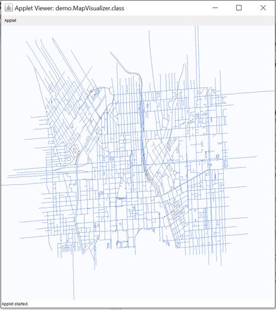

# OSMGraph
This code is a demonstration on how to make a graph out of a city roads network (or any network) 
# Graph
Open Street Map (OSM) is used to extract the basic geographic data for any selected network of interest.
The JGraphT is used to model this network by building a graph out of the roads network in which the streets are the edges and intersections are the nodes connecting the streets.JApplet is used for the visualization.

# Link Costs (Travel Time) 
Later, the interactions between the streets configuration, travel times, and state of traffic, is captured and trough the physical laws and is calibrated with the real world data and is added to the graph.The final model could get the real world data as an input and learns the relationships through the model’s functions and regulations.
Having the roads network as a graph and finding the relations, the proposed model enables the user to estimate the travel time of any path between any two points in the network and get as many as needed shortest paths between those points. 
Here, the Main.java is a user interface that ask the user to give the origin and destination and the time of day and the run results is the shortest path and its travel time.

